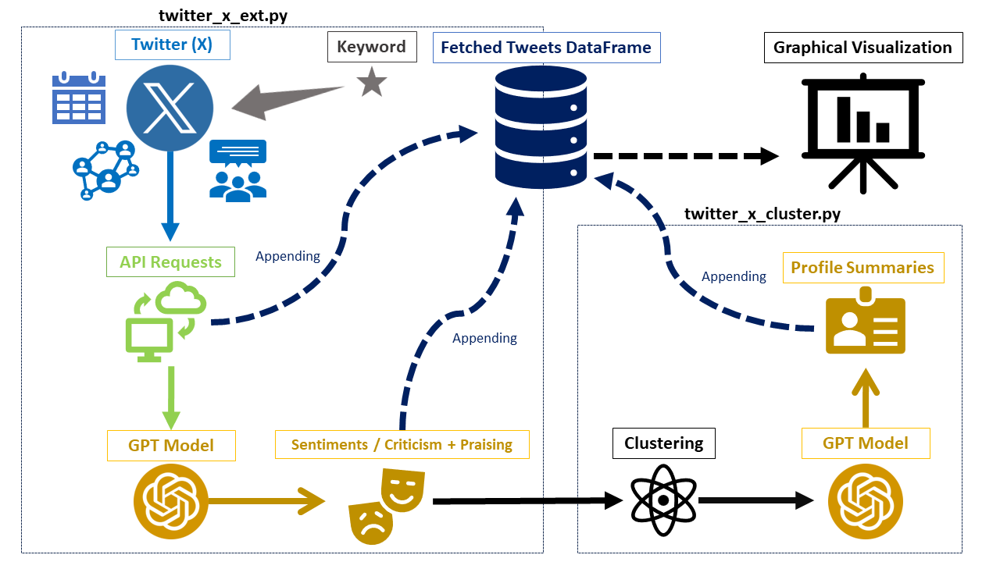

<p align="center">
  
</p>

# Entity Reputation Profiler
This tool is designed to analyze the reputation and sentiment towards a specific entity (e.g., product, public figure, organization) by collecting and processing relevant tweets from the social network Twitter (X). The core functionality involves fetching tweets that mention the target entity within a specified date range, and then performing sentiment analysis on the remaining tweets.   
   
The sentiment analysis categorizes the tweets into positive (praises) and negative (criticisms) sentiments towards the target entity. Additionally, it identifies the emotions and attitudes expressed in the tweets.  
The tool then employs natural language processing techniques to preprocess and cluster the summaries of criticisms and praises extracted from the analyzed data. These clustered text segments are further analyzed using a language model (GPT) to gain deeper insights into the prominent themes and patterns within the criticism and praising categories.   
    
The ultimate goal is to provide a comprehensive reputation profile for the target entity, highlighting the sentiments, emotions, criticisms, and praises expressed in the social media conversations. This information can be valuable for various purposes, such as product improvements, marketing strategies, reputation management, or research and intelligence gathering.   
     
### Advantages
Firstly, the utilization of large language models instead of the previously common methods such as the Zero-Shot Classification (BERT) give us a level of classification accuracy that is unmatched by the 'old' models, as well as a natural language processing that understands small nuances in the texts, and identifies broad patterns and meanings. Secondly, it is worth to notice that if one directly ask ChatGPT about major problems about a newley released product for example - the results cannot be validated, nor we know it's output sources.   

A tool that extracts major advantages and disadvantages of a product for example from tweets for a predefined time period, as opposed to directly asking ChatGPT, offers several distinct benefits:   
* Real-Time User Feedback: Tweets often reflect real-time user experiences and opinions. This immediacy captures the current public sentiment about a product, which can be more up-to-date than a pre-trained model like ChatGPT.   
* Diversity of Opinions: Twitter hosts a wide range of users from different backgrounds, providing a diverse array of opinions. This diversity can offer a more comprehensive view of a product’s strengths and weaknesses compared to the potentially limited or generalized knowledge base of ChatGPT.   
* Specific Use-Case Scenarios: Users often tweet about specific scenarios in which they used the product. This specificity can give insights into how the product performs under various conditions, something that ChatGPT might not detail unless it has been trained on similar specific data.   
* Unprompted Reviews: Tweets about a product are usually unprompted and genuine, providing honest and unfiltered feedback. In contrast, ChatGPT's responses are based on its training data, which might not fully capture the nuances of spontaneous user opinions.   
* Trend Analysis: Analyzing tweets over time allows for the identification of changing trends in public opinion about a product. This dynamic perspective is something that a static database, like the one ChatGPT relies on, might not capture.   
* Identifying Influencer Opinions: Influencers and thought leaders often share their opinions on Twitter. Their views can significantly impact public perception, and analyzing their tweets can provide insights into influential opinions about a product.   
* Sentiment Analysis: Tools that analyze tweets can employ advanced sentiment analysis techniques to quantify public opinion, providing a more structured and measurable understanding of the advantages and disadvantages as perceived by users.   
* Competitive Analysis: By comparing tweets about similar products, one can gain insights into how a product stacks up against its competitors in real users views.   
* Problem Detection: Users often tweet about issues or problems they encounter with a product, providing early detection of potential flaws or areas for improvement.

### Disadvantages
* Quality and Reliability: Tweets can sometimes be misleading, incorrect, or based on incomplete information.
* Potential for Bias and Manipulation: Tweets can be subject to bias or manipulation, such as paid endorsements, targeted campaigns against a product, or tweets written by bots. This can distort the real picture of a product's strengths and weaknesses.
* Groupthink: Twitter can sometimes foster echo chambers, where only similar opinions are shared and amplified, leading to a biased view of a product’s reception.

## The Scripts
There are two separate scripts:
twitter_x_ext.py for extracting the tweets by keyword within a date period, as well as utilizing GPT for finding criticisms and praisings from the tweets, and twitter_x_cluster.py for reducing the criticisms and praisings into a meaningful list of insights by clustering and profiling major problems, issues, advantages, and other useful information for further improvements. The reason for splitting the scripts is because we want one to be independent of the other. For example, it takes a long time to export a large amount of tweets, and we don't want that if there is a certain problem or error, the proccess will be interrupted. Therefore, using the second script only when we have a Dataframe file ready with all the data of the tweets only then we will want to run the second script to cluster the complete set of data.


<p align="center">
  
</p>
<p align="center">
  
</p>

### Dimensions or Features
The following is a complete list of dimensions or features of the extracted data, fit into the output dataframe:    
keyword, tweet_id, screen_name, name, text, bookmarks, favorites, created_at, year, month, day, day_of_week, time, date, lang, views, quotes, replies, retweets, followers_count, friends_count, favourites_count, verified, criticism, praising, negative, positive, neutral, anticipation, happiness, sadness, anger, fear, disgust, surprise, contempt, guilt, shame, curiosity, pride, sympathy.   

* We chose the categories for classification after calculating correlations between the different emotions to check that there are no emotions with a correlation that is too high, so as not to get results for too similar dimensions. Emotions with too similar correlations of 0.85 or higher were removed from the list. Furthermore, the list of emotions is arbitrary, and any other suitable emotion can be added to the list, provided of course that it does not have a high correlation with another emotion already on the list.   
   
* We tested correlations between the feelings or sentiments and dimensions such as the amount of views, the amount of likes, the amount of followers, the amount of shares, etc., but we received correlations that are not strong enough. For example, the highest correlation we received: negative sentiment has a significant correlation of r=0.100*** to the amount of reactions for tweets.

## Requirements:
* Make sure to create an account and register for an API key, and set it in config.py - https://rapidapi.com/hub.  
* Make sure that all the latest required packages are installed from requirements.txt.
* In twitter_x_ext.py: start and end dates (start_date_str, end_date_str), the search word (search_word), the word to exclude (not_containing_str), the minimum favorites for a tweet (min_faves), and the number of pages (num_pages) to be fetched must be set manually.

## Examples:
### Example 1: 'iPhone 15 Pro Max'
Let's demonstrate the work of the tool through analyzing and creating a profile for a product like the iPhone 15 Pro Max. First, we will extract tweets containing the keyword iPhone 15 Pro Max. The API uses queries, which means the keyword should be written in this way: 'iPhone-15-Pro-Max'. After that, we will specify the time period from which we would like to retrieve the tweets, for example, a start date of 2023-09-01 and an end date of 2024-01-01. In addition we would like to retrieve tweets with a minimum of 10 Favorites (likes) to limit our search to more popular tweets. We also want to specify which word we want to exclude or don't want to appear in the tweets, for example we don't want the word 'Lightroom' to appear so that tweets talking about photo editing won't be extracted as it is not relevant for profiling criticisms and praisings - we want tweets that talk about the device itself. In this example we extracted a relatively small number of tweets for iPhone-15-Pro-Max (about 4400 tweets for the specified date period). Let's check the data we have extracted so far. We will load them into a graph referring to some of the features:

<p align="center">
  
</p>

In this example, we see the plotting of four different emotions (anticipation, curiosity, anger, and happiness). emotions are rated from 0 to 100. A notable peak in 'anticipation' is observed around the date labeled as iPhone 15 Release Date, which coincides with what one would expect around a product launch. The 'happiness' line also shows a peak around this date, suggesting positive reception. In contrast, 'anger' shows relatively lower levels throughout, with some small peaks that do not coincide with the release date. 'Curiosity' exhibits peaks both before and after the release date, suggesting that interest spikes occurred at multiple points, possibly due to announcements or other related news events. Overall, the graph suggests that anticipation and happiness were the dominant emotions expressed in relation to the iPhone 15 Pro Max around its release, with anticipation being the strongest emotion on average. Curiosity had a moderate presence throughout, with peaks at various points, while anger was the least expressed emotion according to this analysis.

<p align="center">
  
</p>


This examplary output report is a detailed profile or summary of the clusters and their criticisms related to the iPhone 15 Pro Max, categorized by specific aspects or features, each followed by a count of mentions.

<p align="center">
  
</p>

The graph provided above is a timeline analysis of criticism related to the iPhone 15 Pro Max, mapped against specific dates.   
Axis Description: The X-axis represents time with dates formatted as MM/DD/YYYY. The Y-axis lists different categories of criticism clusters with exemplary summaries of issues associated with the iPhone 15 Pro Max, which are grouped into clusters of similar complaints or experiences. Each box on the Y-axis seems to correspond to a distinct criticism topic, with related subtopics or specific issues mentioned below the main category title.   
     
Data Representation: The timeline uses a box plot-like representation to show the concentration and spread of criticisms over time. Each box extends from the earliest to the latest date where criticisms were observed, with the line inside the box likely representing the median date. The "whiskers" extend to the dates with the least frequency of criticisms, while outliers are represented by individual dots beyond the whiskers.    
     
#### Insights:    
* Pre-Release Criticism: Some criticisms appear before the iPhone 15 release date, which could be related to leaks, rumors, or issues with previous models anticipated to persist in the new release.
* Post-Release Criticism: There is a noticeable concentration of criticisms shortly after the release, possibly indicating that early adopters faced immediate issues with their devices.    
* Spread and Duration: The "Battery" cluster has the widest spread, indicating that these issues were reported over a longer time frame than others. In contrast, the "Galaxy" cluster is more concentrated, suggesting a shorter period of intense comparison with the Samsung Galaxy S23 Ultra.    
* Resolution of Issues: If the boxes represent a timeline of complaints, the absence of extended whiskers or outliers past certain dates might suggest that the issues were resolved or that complaints subsided over time.   
       
       
       
### Example 2: 'Israel'
We would like to examine the attitude towards Israel before and after the events of October 7th 2023. We extracted about 50,000 tweets containing the word 'Israel' in all possible languages for the date range from July to December 2023. Let's examine the following graph:

<p align="center">
  
</p>

The sentiments Negative, Neutral, and Positive are plotted over a period from June to December, with specific events marked on the timeline.   

Key observations from the graph:   
* The negative sentiment has the highest mean value (around 0.45) and also the highest IQR (0.75), indicating both a higher average presence and greater variability in negative sentiment over the period.    
* Positive sentiment has the lowest mean (approximately 0.18) and a small IQR (0.1), suggesting that positive sentiments are less variable and consistently lower.    
* Neutral sentiment has a mean of around 0.32 with an IQR of 0.4, showing moderate presence and variability.    
* Notable peaks in negative sentiment correspond with marked events, particularly around the "Airstrikes on Gaza" and "Israeli Invasion of Gaza", suggesting these events elicited strong negative reactions.    
* The "7th of October" marks a significant peak for negative sentiment from that point. The differences between the sentiments are significant, so there is a clear distinction between them. The positive decreases along with the neutral, while the negative increases and continues to increase as the invasion progresses.   
* The "Prisoners Exchange" event shows a peak in positive sentiment and a decrease in negative sentiment, suggesting a favorable reaction to this event.    
* The smoothed lines help to visualize the general sentiment trend over time, revealing the fluctuating public reaction to the events marked on the graph. The data suggests that the events had a significant impact on the sentiments expressed, with negative sentiment being more pronounced overall.    

<p align="center">
  
</p>

The graph is a time series plot of two emotional sentiments, shame and pride, against a timeline that includes key events.    

Observations from the graph:    

* Peaks in the sentiment of shame toward 'Israel' are visible at several points, particularly spiking around the "Israeli Invasion of Gaza". This suggests that this event elicited a strong feeling of shame toward 'Israel' among the discourse captured in the data.   
* The sentiment of pride shows less fluctuation and remains lower in comparison to shame, as indicated by its lower mean value.    
* The "Airstrikes on Gaza" event shows a notable peak in shame with a corresponding increase in pride, but unmatched against shame.   

<p align="center">
  
</p>

The graph displays a time series of retweet counts, presumably from Twitter, over a period with specific events marked along the timeline. The blue line represents the number of retweets over time, with spikes indicating increased activity.    

Observations from the graph:    

* There are noticeable spikes in retweet activity corresponding with the "Airstrikes on Gaza" and the "Israeli Invasion of Gaza" events. This suggests these events generated a significant amount of attention and were widely discussed or shared on the platform.    
* The "Prisoners Exchange" event also aligns with a spike in retweet numbers, suggesting heightened public interest or approval, which prompted users to share the content more broadly.   
Overall, retweet activity fluctuates, with the most pronounced peaks corresponding to events that are likely of high public interest or concern, as indicated by the higher volume of retweets.
The graph is useful for understanding the relative scale of public engagement and the spread of information on social media in relation to specific events.

<p align="center">
  
</p>
<p align="center">
  
</p>

The graphs provided display timelines with cluster names categorized under criticism, represented in two separate graphs, one for nouns and the other for adjectives and verbs in relation or toward 'Israel'. Each graph plots the occurrences of these words over a timeline, with specific dates marked along the bottom axis. The first image focuses on nouns such as "apartheid", "genocide", "terrorism", "occupation", and "refugee" for example. The occurrences of these words are indicated by the horizontal lines and the box plots suggest the duration of the discussion about these terms. The second image presents adjectives and verbs, including "killing", "illegal", "criticizing", and "propaganda" for example. the black plots denote outliers.

Both graphs highlight the "7th of October" with a red vertical line, which signify a significant date in relation to the usage of these keywords.    

These graphs could be used to analyze patterns of discourse, identify the prevalence of certain criticism topics over time, and observe how specific events might influence the language used in public discussions or social media. The distribution of terms across the dates could provide insights into the focus and intensity of criticism related to the events mentioned.

<p align="center">
  
</p>

In this bars plots we can see different nouns in relation to 'Israel', and the level of sympathy toward each cluster name. here we can see that the cluster name 'hostage' have the highest sympathy level, in other words, the tweets that contain the word 'hostage' in relation to 'Israel' have the highest level of sympathy.

<p align="center">
  
</p>

The horizontal bar chart represents the mean positivity score of tweets across various languages, denoted by their two-letter language codes. The bars and their color indicate the level of positive sentiment in content for each language. A longer bar signifies a higher positivity mean, while a shorter bar indicates a lower positivity mean. The color of the bars likely represents the intensity of positivity.   

At the top of the chart, the "ko" and "hu" language code, which typically stands for Korean and Hungarian, has the longest bar, suggesting that content in this language had the highest average positivity score among the languages represented.    

This chart can be useful for understanding which language-speaking communities are expressing more positive sentiments in their content toward 'Israel', according to the data source analyzed.     


```bash
git clone https://github.com/reab5555/Entity-Reputation-Profiler.git
cd Entity-Reputation-Profiler
pip install -r requirements.txt
